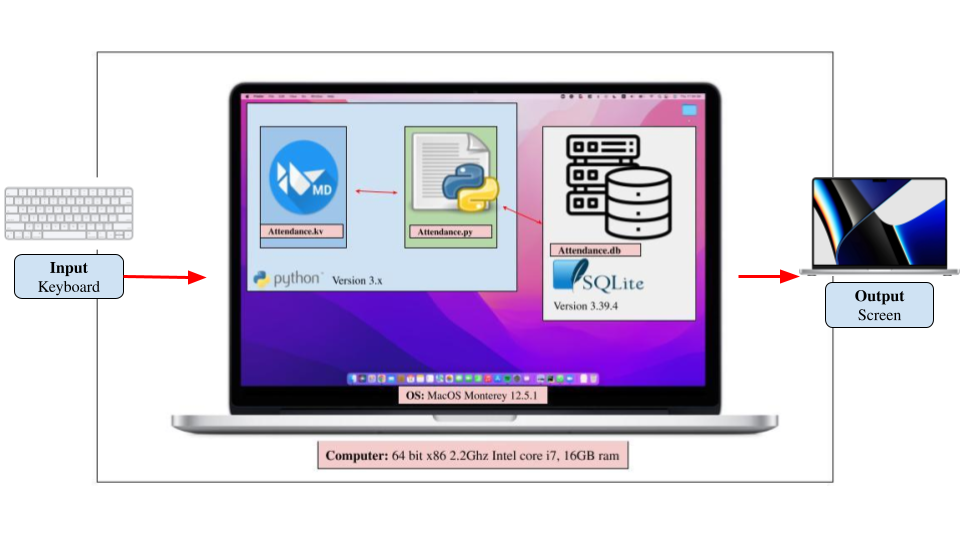
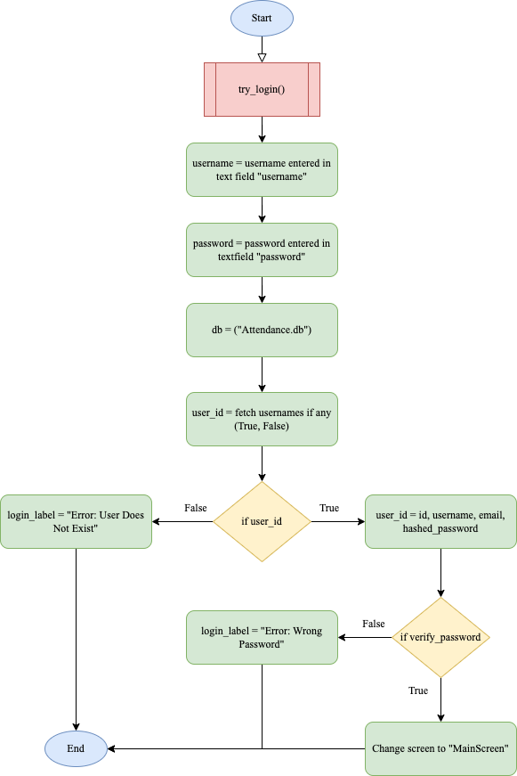
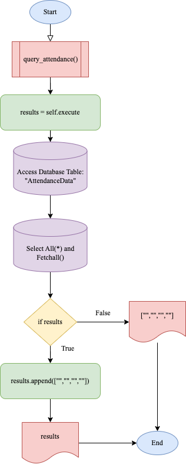
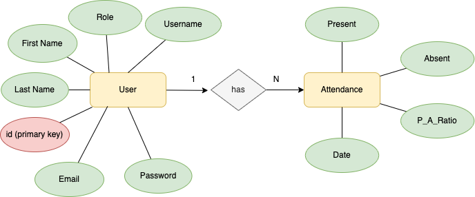

# Unit IA: Client Project (Club Attendance Application)

# Criteria A: Planning (489 words) 
## Problem definition
The badminton club leaders have to mark attendance every time they practice badminton. Currently, they use google sheets, which turn out to be very hard to use, especially with limited wifi. The badminton club leaders have approached me to create an application that can efficiently record the attendance of the club. They want an application that has a GUI that has accessible buttons and textboxes to record attendance with individual names and must work even without access to the internet. 

## Proposed Solution:

### Design Statement
I will design and make an application that will keep track of the student’s attendance for the badminton club leaders. The application will be able to keep track of all data through the use of a database and a login system. To ensure security and privacy, the login system will have a hashing system and will all be saved in a local database using SQLite. The application will feature a GUI so that my client can easily utilize the app. This all will be created using Python 3.x with the help of KivyMD for GUI construction. All code will be created and developed on the application, Pycharm. This app will take 4 weeks to complete and will be evaluated according to the criteria.

### Why Python?
Python is ranked first in the “most well known and used programming language” [1], compared to other alternatives (C++ and Javascript). This will not only allow me to have greater access to resources but most importantly allow future developers to update the application, future proofing it. As the developer, I am most knowledgeable in Python, ensuring that the client will be able to receive the application before the deadline. Considering the benefits of the client, it's safe to say that Python is the most suitable programming language. 

### Why KivyMD?
Alternatives such as Libavg or PyQT do exist, however, KivyMD is compatible with all 3 operating systems (including mobile devices) [2] allowing the client to access the application. Additionally, KivyMD’s goal, “to approximate Google's Material Design spec” [3] also greatly relates to the client's experience as the GUI is what the client sees. KivyMD is also the library I am the most familiar with and will help me ensure a delivery to the client in a timely manner. For these reasons, I have concluded that KivyMD is the most appropriate for my project.

### Why SQLite?
Compared to other databases such as Improvado or RDBMS, SQLite is cross compatible with a number of operating systems [4]. This is beneficial to the client as the compatibility will ensure the client can access it through any platform and also can ensure futureproofing of the application as developers can modify the database if necessary. As the developer, I am the most familiar with this database which will allow me to ensure that the client's deadline is met. With this flexibility and superiority over other alternatives, SQLite will be used for this project.

### Success Criterias:
1. The application must have a secure registration / login system where the user can insert their email, username and password and all be stored locally.
2. The application provides tools to record all names and weekly attendance status for individual students via the GUI and must be stored locally. 
3. The application must be able to host different user roles: Administrator / Leaders and Students. 
4. The application provides a tool for the referee to keep track of the points in a game by clicking on the courts whenever there is a point gained. 
5. The application must be able to export everyones name and attendance data into a PDF format.
6. The application must be able to display the number of absence/presence per user and is only visible to the admin. 

## Client Approval

## Works Cited

1. "The 10 Most Popular Programming Languages to Learn in 2021." Northeastern University Graduate Programs, 14 May 2021, www.northeastern.edu/graduate/blog/most-popular-programming-languages/. Accessed 28 Aug. 2022.

2. ResellerClub. "The 6 Best Python GUI Frameworks for Developers." Medium, 18 Oct. 2019, medium.com/teamresellerclub/the-6-best-python-gui-frameworks-for-developers-7a3f1a41ac73. Accessed 28 Aug. 2022.

3. "Kivymd/KivyMD: KivyMD is a Collection of Material Design Compliant Widgets for Use with Kivy, a Framework for Cross-platform, Touch-enabled Graphical Applications. Https://youtube.com/c/KivyMD Https://twitter.com/KivyMD Https://habr.com/ru/users/kivymd Https://stackoverflow.com/tags/kivymd." GitHub, github.com/kivymd/KivyMD. Accessed 28 Aug. 2022.

4. "SQLite Home Page." SQLite, www.sqlite.org/index.html. Accessed 28 Mar. 2022.

5. "How To Use the Sqlite3 Module in Python 3." DigitalOcean – The Developer Cloud, 2 June 2020, www.digitalocean.com/community/tutorials/how-to-use-the-sqlite3-module-in-python-3. Accessed 28 Aug. 2022.

-----------------------------------------------------------------------------------------------------------------------------------------------------------

# Criteria B: Design
## System Diagram

 

### Fig1. System Diagram of the application

The system diagram shows how the application interacts with each other. The input will be done with a keyboard (input of numbers) and the output will be shown on the screen. The application will be on a computer, which will be inside the MacOS operating system. The app will then be operated via Python version 3.x and executed on Pycharm via the file name, Attendance.py and Attendance.kv. These python files are then connected with a SQL database (version 3.39.4) called Attendance.db.

## Wireframe Diagram

### Fig2. Wireframe Diagram of the GUI

This Wireframe Diagram shows the generated outline of the GUI of the application. It shows the functionalities of every button planned out to be used in the application and shows all 5 screens of the application.

#### Login Screen
This will be the screen the user will be presented when first opening the application. The user will have to enter their username and password and click the login screen to go to the main screen or click the register button if not registered. This is accessible to all roles. 

#### Registration Screen
The registration screen will be the screen where the user can register a username, password and email inorder for them to access the application. This is accessible to all roles. 

#### Main Screen
The main screen consists of all the buttons: "Add Attendance", "History", "Referee Mode" and "Log Out". These buttons will switch the screens to its labelled screens. This is accessible to all roles. 

#### Attendance Screen
The attendance screen has the list of names of the students inputted in the Student Input Screen and the user can record if the student is present or not. This is only accessible to "LEADER" and "ADMIN" roles. 

#### Student Input Screen
This screen is to edit the student list within the badminton club. The screen will be able to add or delete any names that will be displayed for attendance. This is only accessible to "LEADER" and "ADMIN" roles. 

#### Referee Screen
This screen will display a point couter where it will count the points of every side for each click. This is accessible to all roles. 

#### History Screen 
This screen is to view the past history of each students number of absence and presence. This is only accessible to "LEADER" and "ADMIN" roles. 

#### Admin Screen 
This screen will be able to change any users roles from "STUDENTS" to "LEADER" or "ADMIN" or vice versa. This is only accessible to "ADMIN" roles. 

## Flow Diagrams

### Fig3. What does it do?
This is the login function when a user clicks the "login" button in the GUI it will call this function. The username and password variables are defined in its respective text fields in the GUI. The database (attendance.db) is also defined as db. The user_id produces a true or false which relate to the if statement where when false, displays a message called "Error: User not found" and when true moves on to the next if statement which verifies the password. The next if statement will compare the inputted passwords with the respective username inputted and if true changes the screen to the "MainScreen" and when false displays a message that says "Error: Wrong Password". 

### Fig4. What does it do?
This is a function where the program fetches data from the table database "Attendance.db" The fetched data will go through an if statement, evaluating on whether the data is valid, specifically if all fields are met. If so, the data will be appended to the database and if not, the code will output nothing. 

### Fig5. What does it do?
This is a function that is active when the user clicks the referee mode. The left point and right point variables are set to 0 at first to reset the counter if there were past games going on. The variable playing is set to True for the while loop to loop its self while the gams is still in progress. The first if statement is when the left box is clicked, the counter of the left point will increase by one. The same goes for the next if statement just when the right one is clicked.  After the if statements, all variables set to each side will be displayed onto the GUI through changing the label on kivyMD.

## ER Diagram

### Fig6. ER (Entity Relationship) Diagram
The entity-relationship diagram shows the interaction between entity sets, stored in the database table with its respective attribute. In this diagram, yellow rectangles represent the entity that contains attributes. Red circles are the primary key, which are used to uniquely identify each record in the database. 
## UML Diagram

### Fig7. UML Diagram for Application Database

## Normalized Table

| id (primary key)  | Username | Password (Encrypted)                                                                   | Email                    | First Name | Last Name | Role   |
|-------------------|----------|----------------------------------------------------------------------------------------|--------------------------|------------|-----------|--------|
| 1                 | rei2022  | $pbkdf2-sha256$3000$/58TQui919pbq5VyzjnHGA$.vAtZD5XUGo/ycoGnUBnAu22fVpl/dH6MqvxxKs4BPM | rei2022_test@gmail.com   | Rei        | Nishi     | Admin  |
| 2                 | alex332  | $pbkdf2-sha256$3000$NGas9f5fC0HIWcv5/5/Tug$zWWc.J8KZvQgHgRFLiOgxJH/1EPP2cb9PhTIu4XGg2Q | alex332_test@gmail.com   | Alex       | Soh       | Leader |
| 3                 | rub493   | $pbkdf2-sha256$3000$P2cM4fxfKwWAECKk9F6rtQ$YjCPri1UwCa173W6LuQj9TgAVPds8zGl3oHLViuK.Cg | rub493_test@yahoo.co.jp  | Rub        | Pinz      | Member |
| 4                 | user123  | $pbkdf2-sha256$3000$GwNg7H1vLcU4J8R4zxkDYA$vohr75tXcNl4OMlpngH6gjq6IGx8Pua7O3TtTMqhUsE | user123_test@hotmail.com | User       | Name      | Member |
### This is the normalized table of the user database. 

| Date        | First Name | Email                    | Present | Absent | Percentage (%) |
|-------------|------------|--------------------------|---------|--------|----------------|
| oct.10.2022 | Rei        | rei2022_test@gmail.com   | 6       | 1      | 86             |
| oct.27.2022 | Alex       | alex332_test@gmail.com   | 5       | 2      | 71             |
| nov.1.2022  | Rub        | rub493_test@yahoo.co.jp  | 7       | 0      | 100            |
| nov.4.2022  | User       | user123_test@hotmail.com | 4       | 3      | 57             |
### This is the normalized table of the attendance data. 

# Test Plan

| Instruction                                    | Category           | Input                                                                                                                                 | Expected Output                                                                                                   | Description                                                                                                 | Success Criteria |
|------------------------------------------------|--------------------|---------------------------------------------------------------------------------------------------------------------------------------|-------------------------------------------------------------------------------------------------------------------|-------------------------------------------------------------------------------------------------------------|------------------|
| Test Registration Screen                       | Unit testing       | An input in all 3 fields (email, username and password)                                                                               | All 3 attributes inside the database and the password being hashed and encrypted                                  | This will test if the registration and encryption works or not                                              | 1                |
| Test Login System (Success)                    | Unit testing       | An input of correct attributes (username = "test", and password = "test")                                                             | A change in screen to the WelcomeScreen                                                                           | This will test if the Login System works by matching the usernames and decrypting the hashed passwords      | 1                |
| Test Login System (Wrong pass)                 | Unit testing       | An input of the wrong password (username = "test, and password = "oiwf")                                                              | A text message that says "Error: Wrong Password"                                                                  | This will test if the Login system works and if it could detect the wrong password                          | 1                |
| Test Login System (Wrong user)                 | Unit testing       | An input of the wrong username (username = "oiwf, and password = "test")                                                              | A text message that says "Error: User Does Not Exist"                                                             | This will test if the Login system works and if it could detect the nonexistent username                    | 1                |
| Test Logout                                    | Unit testing       | Click "logout" button after login in the GUI                                                                                          | Screen switching to login page                                                                                    | This will test if the logout button will put the user outside the app                                       | 1                |
| Test Attendance Input (Success)                | Unit testing       | Fill out all necessary fields shown on the GUI (date, present, absent)                                                                | All fields shown in the local database (attendance.db)                                                            | This will test is the attendance input system works or not                                                  | 2                |
| Test Attendance Input (Fail)                   | Unit testing       | Fill out only parts of necessary fields shown on the GUI (date, present, absent)                                                      | A text message that says "Error: Please fill in all fields"                                                       | This will test if the attendance page could detect empty required fields                                    | 2                |
| Displaying previous attendances (Success)      | Unit testing       | Using an account with "leader" status, click on the "History" button in the WelcomeScreen                                             | A table that shows all previous attendance data inputted by users                                                 | This will test if the app can display information gathered from the local database                          | 3, 6             |
| Displaying previous attendances (Fail)         | Unit testing       | Using an account with "member" status, click on the "History" button in the WelcomeScreen                                             | A text message that says: "Error: Permission not granted"                                                         | This will test if the app can display attendance information only to admins and leader roles                | 3, 6             |
| Test Referee counter                           | Unit testing       | On the Referee Screen, click on left and right courts                                                                                 | A number increasing every tap by 1                                                                                | This will test if the referee mode works and is able to keep track of points throughout                     | 4                |
| Test Referee reset                             | Unit testing       | On the Referee Screen, click on the "reset" button in the GUI                                                                         | Both left and right point numbers resetting to 0                                                                  | This will test if the referee mode works and is able to reset the counter when necessary                    | 4                |
| Test PDF Export (success)                      | Unit testing       | Using an account with "leader" status, on the History Screen, click on the "Export to PDF" button in the GUI                          | A file of all attendance data (date, name, present, absent, ratio) in a PDF format saved on the local device used | This will test if the app is able to take data from the database and export it as a PDF to the local device | 5                |
| Test PDF Export (fail)                         | Unit testing       | Using an account with "leader" status, on the History Screen, with an empty datatable, click on the "Export to PDF" button in the GUI | A text message that says: "Error: data table empty"                                                               | This will test if the app is able to detect an empty datatable                                              | 5                |
| Revising the cohesiveness and accuracy of code | Code review        | -                                                                                                                                     | There are no syntax errors and all variables are inline with the rest of the code                                 | This will see if the code is working or not                                                                 | -                |
| Appropriate variable names in code             | Code review        | -                                                                                                                                     | All variables used are simple and make sense to its functionality and doesn't use single letter variables         | This will see if the program has good coding practices or not                                               | -                |
| Appropriate comments in code                   | Code review        | -                                                                                                                                     | Comments throughout the code explaining each functionality, all making sense                                      | This will see if the program has good coding practices or not                                               | -                |
| GUI functionality                              | Integration review | Switch between different screens via the buttons in the GUI                                                                           | Switching between different screens and GUI works without any errors.                                             | This will test if the GUI is functioning. Kivy and Python is communicating with each other or not           | -                |
| Final compiliation check                       | System review      | Reviewing if all client needs are met with the success criteria                                                                       | The app meets all requirements and success criterias                                                              | This will test if the app is enough to satisfy the clients needs                                            | -                |
| Application utilized by user                   | Acceptance check   | Letting the client use the application                                                                                                | The client is able to navigate throughout the application and is satisfied with the application                   | Further improvements established by the developer and feedback of the client will be gained                 | -                |
|                                                |                    |                                                                                                                                       |                                                                                                                   |                                                                                                             |                  |
|                                                |                    |                                                                                                                                       |                                                                                                                   |                                                                                                             |                  |

## Record of Tasks

# Criteria C:

