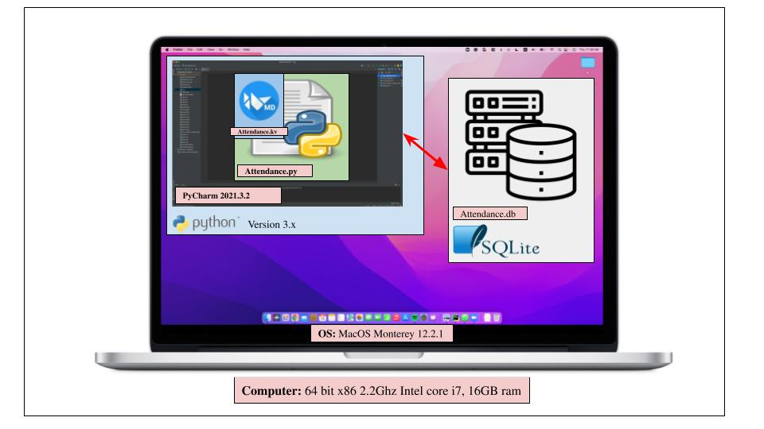

# Unit IA: Client Project (Club Attendance Application)

# Criteria A: Planning (489 words) 
## Problem definition
The badminton club leaders have to mark attendance every time they practice badminton. Currently, they use google sheets, which turn out to be very hard to use, especially with limited wifi. The badminton club leaders have approached me to create an application that can efficiently record the attendance of the club. They want an application that has a GUI that has accessible buttons and textboxes to record attendance with individual names and must work even without access to the internet. 

## Proposed Solution:

### Design Statement
I will design and make an application that will keep track of the student’s attendance for the badminton club leaders. The application will be able to keep track of all data through the use of a database and a login system. To ensure security and privacy, the login system will have a hashing system and will all be saved in a local database using SQLite. The application will feature a GUI so that my client can easily utilize the app. This all will be created using Python 3.x with the help of KivyMD for GUI construction. All code will be created and developed on the application, Pycharm. This app will take 4 weeks to complete and will be evaluated according to the criteria.

### Why Python?
Python is ranked first in the “most well known and used programming language” [1], compared to other alternatives (C++ and Javascript). This will not only allow me to have greater access to resources but most importantly allow future developers to update the application, future proofing it. As the developer, I am most knowledgeable in Python, ensuring that the client will be able to receive the application before the deadline. Considering the benefits of the client, it's safe to say that Python is the most suitable programming language. 

### Why KivyMD?
Alternatives such as Libavg or PyQT do exist, however, KivyMD is compatible with all 3 operating systems (including mobile devices) [2] allowing the client to access the application. Additionally, KivyMD’s goal, “to approximate Google's Material Design spec” [3] also greatly relates to the client's experience as the GUI is what the client sees. KivyMD is also the library I am the most familiar with and will help me ensure a delivery to the client in a timely manner. For these reasons, I have concluded that KivyMD is the most appropriate for my project.

### Why SQLite?
Compared to other databases such as Improvado or RDBMS, SQLite is cross compatible with a number of operating systems [4]. This is beneficial to the client as the compatibility will ensure the client can access it through any platform and also can ensure futureproofing of the application as developers can modify the database if necessary. As the developer, I am the most familiar with this database which will allow me to ensure that the client's deadline is met. With this flexibility and superiority over other alternatives, SQLite will be used for this project.

### Success Criterias:
1. The application must have an encrypted registration system where the user can register their email, username and password and be saved into a database.
2. The application must feature a log in/out system where the user can enter username and password and be checked with the encrypted database to match credentials.
3. The user must be able to record all names and attendance status for individual students via the GUI and must be encrypted and saved into the database. 
4. The application must be able to fetch all previously inputted data from the encrypted database and display it via the GUI.
5. The application must feature a home screen, data input screen, previous data page and login screen. 

## Client Approval

## Works Cited

1. "The 10 Most Popular Programming Languages to Learn in 2021." Northeastern University Graduate Programs, 14 May 2021, www.northeastern.edu/graduate/blog/most-popular-programming-languages/. Accessed 28 Aug. 2022.

2. ResellerClub. "The 6 Best Python GUI Frameworks for Developers." Medium, 18 Oct. 2019, medium.com/teamresellerclub/the-6-best-python-gui-frameworks-for-developers-7a3f1a41ac73. Accessed 28 Aug. 2022.

3. "Kivymd/KivyMD: KivyMD is a Collection of Material Design Compliant Widgets for Use with Kivy, a Framework for Cross-platform, Touch-enabled Graphical Applications. Https://youtube.com/c/KivyMD Https://twitter.com/KivyMD Https://habr.com/ru/users/kivymd Https://stackoverflow.com/tags/kivymd." GitHub, github.com/kivymd/KivyMD. Accessed 28 Aug. 2022.

4. "SQLite Home Page." SQLite, www.sqlite.org/index.html. Accessed 28 Mar. 2022.

5. "How To Use the Sqlite3 Module in Python 3." DigitalOcean – The Developer Cloud, 2 June 2020, www.digitalocean.com/community/tutorials/how-to-use-the-sqlite3-module-in-python-3. Accessed 28 Aug. 2022.

-----------------------------------------------------------------------------------------------------------------------------------------------------------

# Criteria B: Design
## System Diagram

 

### Fig1. System Diagram of the application

The system diagram shows how the application interacts with each other. The input will be done with a keyboard (input of numbers) and the output will be shown on the screen. The application will be on a computer, which will be inside the MacOS operating system. The app will then be operated via Python version 3.x and executed on Pycharm via the file name, Unit3.py and Unit3.kv. These python files are then connected with a SQL database called Unit3.db.

## Wireframe Diagram

### Fig2. Wireframe Diagram of the GUI

This Wireframe Diagram shows the generated outline of the GUI of the application. It shows the functionalities of every button planned out to be used in the application and shows all 5 screens of the application.

## Flow Diagrams

!(flow1)
### Fig3. What does it do?
Caption

!(flow2)
### Fig4. What does it do?
Caption

!(flow3)
### Fig5. What does it do?
Caption

## ER Diagram
!(ERDiagram)
### Fig6. ER (Entity Relationship) Diagram

## UML Diagram

### Fig7. UML Diagram for Application Database

## Table of data

This is the basic outline of the database for the user inputs.
This is the basic outline of the database for the sleep inputs.

# Test Plan

## Record of Tasks

# Criteria C:

