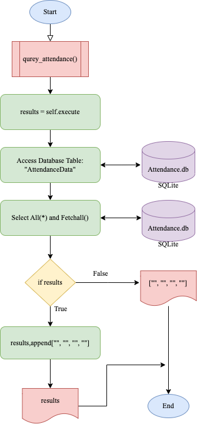

# Unit IA: Client Project (Club Attendance Application)

# Criteria A: Planning
## Problem definition
The badminton club leaders have to mark attendance and keep track of points. They use Google sheets in a gym with limited wifi, making it impossible to access. The badminton club leaders have approached me to create an application that can be accessed without the internet. It must record the attendance of the club that can be accessed in later days and keep track of the points of a game. They want a GUI that has accessible buttons with individual names to record attendance and keep track of points. They also want a login system to differentiate who can add attendance logs. The client has approved all of the success criteria (Appendix 1).

## Proposed Solution:

### Design Statement
I will design and make an application that will keep track of the member's attendance and serve as a point counter for the badminton club leaders. The application will feature a GUI so that my client can easily utilize the app. This all will be created using Python with the help of KivyMD for GUI construction. This application will take 6 weeks to complete and will be evaluated according to the criteria.

### Why Python?
Compared to other alternatives (Ruby and Swift) Python is “developing a reputation as a secure language”[1] which will prevent potential malicious attacks on the client. Languages like Swift only work on the Apple ecosystem and are not cross-platform, however, Python is “cross-platform” [2] which will make the application accessible from any operating system, making it versatile and convenient for the client. Alternatives such as Ruby tends to “have a slower runtime” compared to Python, meaning that Python can run and compile faster than Ruby, which will ensure the client will have a smoother, faster experience with the app. Ranked first in the “most well-known and used programming language” [3], this will allow the client to have greater support from other developers to update the application in the future as well. 

### Why KivyMD?
Alternatives such as Libavg or PyQT do exist, however, KivyMD is multiplatform meaning that it can be used on a computer and mobile device [4] allowing the client to access the application through their laptops or phones, making the application versatile. Additionally, KivyMD’s goal, “to approximate Google's Material Design spec” [5] also greatly relates to the client's experience as the GUI is what the client sees. For these reasons, I have concluded that KivyMD is the most appropriate for my project.

### Why SQLite?
Compared to other databases such as Improvado, SQLite is cross-compatible with a number of operating systems [6]. This is beneficial to the client as the compatibility will ensure the client can access it through any platform (mobile and desktop), making it convenient for them. Moreover, “SQLite Is Serverless”[7] means that data is stored locally, increasing the read-write speed and security for the client. This also means the client does not have to pay extra money for a dedicated server to store data, making the database completely free. 

### Success Criterias:
1. The application must have a secure registration/login system where the user can insert their email, username and password and all be stored locally.
2. The application provides tools to record all names and weekly attendance status for individual students via the GUI and must be stored locally. 
3. The application must be able to host different user roles: Administrator / Leaders and Students. 
4. The application provides a tool for the referee to keep track of the points in a game by clicking on the courts whenever there is a point gained. 
5. The application must be able to export everyone's name and attendance data into a PNG format.
6. The application must be able to display the number of absences/presence per user and is only visible to the admin. 


## Client Approval
The client has approved all of the success criterias. This can be seen in Appendix 1. 

## Works Cited

1. "How to Write Safe and Secure Python Code, Detect CWE and Avoid Vulnerabilities in Production Code." Codiga: Static Code Analysis in Real-Time, www.codiga.io/blog/secure-python-code-detect-cwe/.
2. Azorin, Paul. "Getting Started with Python." Medium, 3 Aug. 2020, medium.com/@guestposts_92864/getting-started-with-python-973270db33af.
3. "The 10 Most Popular Programming Languages to Learn in 2021." Northeastern University Graduate Programs, 14 May 2021, www.northeastern.edu/graduate/blog/most-popular-programming-languages/. Accessed 28 Aug. 2022.
4. ResellerClub. "The 6 Best Python GUI Frameworks for Developers." Medium, 18 Oct. 2019, medium.com/teamresellerclub/the-6-best-python-GUI-frameworks-for-developers-7a3f1a41ac73. Accessed 28 Aug. 2022.
5. "Kivymd/KivyMD: KivyMD is a Collection of Material Design Compliant Widgets for Use with Kivy, a Framework for Cross-platform, Touch-enabled Graphical Applications. Https://youtube.com/c/KivyMD Https://twitter.com/KivyMD Https://habr.com/ru/users/kivymd Https://stackoverflow.com/tags/kivymd." GitHub, github.com/kivymd/KivyMD. Accessed 28 Aug. 2022.
6. "SQLite Home Page." SQLite, www.sqlite.org/index.html. Accessed 28 Mar. 2022.
7. "SQLite Is Serverless." SQLite, 2 Apr. 2018, www.sqlite.org/serverless.html.

-----------------------------------------------------------------------------------------------------------------------------------------------------------


# Criteria B: Design
## System Diagram


### Fig1. System Diagram of the application

Figure 1 shows how the application interacts with each other. The input will be done with a keyboard (input of numbers) and the output will be shown on the screen. The application will be inside the macOS operating system (ver. Monterey 12.5.1), which will be in the computer itself. The app will then be operated via Python version 3.x and executed via the file name, Attendance.py. The Attendnace.py file is then connected with a GUI construction file, Attendance.kv. Furthermore, the python file is then connected with a SQL database (version 3.39.4) called Attendance.db.

## Wireframe Diagram


### Fig2. Wireframe Diagram of the GUI

Figure 2 shows the Wireframe Diagram of the graphic user interface of the application. It shows the functionalities of every button planned out to be used in the application and shows all 5 screens of the application.

#### Login Screen
This will be the screen the user will be presented with when first opening the application. The user will have to enter their username and password and click the login screen to go to the main screen or click the register button if not registered. This is accessible to all roles. 

#### Registration Screen
The registration screen will be the screen where the user can register a username, password and email for them to access the application. This is accessible to all roles. 

#### Main Screen
The main screen consists of all the buttons: "Add Attendance", "History", "Referee Mode" and "Log Out". These buttons will switch the screens to their labelled screens. This is accessible to all roles. 

#### Attendance Screen
The attendance screen has the list of names of the students inputted in the Student Input Screen and the user can record if the student is present or not. This is only accessible to "LEADER" and "ADMIN" roles. 

#### Student Input Screen
This screen is to edit the student list within the badminton club. The screen will be able to add or delete any names that will be displayed for attendance. This is only accessible to "LEADER" and "ADMIN" roles. 

#### Referee Screen
This screen will display a point counter where it will count the points of every side for each click. This is accessible to all roles. 

#### History Screen 
This screen is to view the history of each student's absence and presence. This is only accessible to "LEADER" and "ADMIN" roles. 

#### Admin Screen 
This screen will be able to change any user's role from "STUDENTS" to "LEADER" or "ADMIN" or vice versa. This is only accessible to "ADMIN" roles. 

## Flow Diagrams

Flowcharts are used to bridge the developer with the user by visualizing complex code for the client to understand the backend of the application. This will help me as the developer to detect any potential bottlenecks that may exist and also help the client as they will be able to follow step-by-step visualized instructions to solve any doubts. 


### Fig3. Authentication system flow diagram
Figure 3 shows the login function when a user clicks the "login" button in the GUI it will call this function. The username and password variables are defined in their respective text fields in the GUI. The database (attendance.db) is also defined as db. The user_id produces a true or false which relates to the if statement where when false, displays a message called "Error: User not found" and when true moves on to the next if statement which verifies the password. The next if statement will compare the inputted passwords with the respective username inputted and if true changes the screen to the "MainScreen" and when false displays a message that says "Error: Wrong Password". 


### Fig4. Flow diagram of fetching data from the database
Figure 4 shows a function where the program fetches data from the table database "Attendance.db" The fetched data will go through an if statement, evaluating whether the data is valid, specifically if all fields are met. If so, the data will be appended to the database and if not, the code will output nothing. 


### Fig5. Referee mode flow diagram
Figure 5 is a function that is active when the user clicks the referee mode. The left point and right point variables are set to 0 at first to reset the counter if past games were going on. The variable playing is set to True for the while loop to loop itself while the games are still in progress. The first if statement is when the left box is clicked, the counter of the left point will increase by one. The same goes for the next if statement just when the right one is clicked.  After the if statements, all variables set to each side will be displayed on the GUI by changing the label on kivyMD.


## ER Diagram

### Fig6. ER (Entity Relationship) Diagram
Figure 6 shows the entity-relationship diagram which shows the interaction between entity sets, stored in the database table with their respective attribute. In this diagram, yellow rectangles represent the entity that contains attributes. Red circles are the primary key, which is used to uniquely identify each record in the database. In this case, there are two entities, one being the user and the other being attendance. These two all intertwine with one another as each user has their attendance status. Each user also has their own attributes such as username, password and email with attendance also having unique attributes such as the number of presences, absence and the percentage of presence. Having a simple two-entity relationship is the best in this case as it is the most efficient and at the same time meets the client's requirements. 

## UML Diagram

### Fig 7. UML Diagram for classes in the application
Figure 7 shows a UML diagram that illustrates the relationship between all the classes that exist within the application.  The boxes are split into three parts: class name, attributes and methods. The arrows show relationship between classes and the inheritance throughout the different classes.

## Normalized Table
### Normalized tables are used to process and organize data in a database table. This includes creating tables and establishing relationships by eliminating redundancy and inconsistent dependency.


| id (primary key)  | Username | Password (Encrypted)                                                                   | Email                    | First Name | Last Name | Role   |
|-------------------|----------|----------------------------------------------------------------------------------------|--------------------------|------------|-----------|--------|
| 1                 | rei2022  | $pbkdf2-sha256$3000$/58TQui919pbq5VyzjnHGA$.vAtZD5XUGo/ycoGnUBnAu22fVpl/dH6MqvxxKs4BPM | rei2022_test@gmail.com   | Rei        | Nishi     | Admin  |
| 2                 | alex332  | $pbkdf2-sha256$3000$NGas9f5fC0HIWcv5/5/Tug$zWWc.J8KZvQgHgRFLiOgxJH/1EPP2cb9PhTIu4XGg2Q | alex332_test@gmail.com   | Alex       | Soh       | Leader |
| 3                 | rub493   | $pbkdf2-sha256$3000$P2cM4fxfKwWAECKk9F6rtQ$YjCPri1UwCa173W6LuQj9TgAVPds8zGl3oHLViuK.Cg | rub493_test@yahoo.co.jp  | Rub        | Pinz      | Member |
| 4                 | user123  | $pbkdf2-sha256$3000$GwNg7H1vLcU4J8R4zxkDYA$vohr75tXcNl4OMlpngH6gjq6IGx8Pua7O3TtTMqhUsE | user123_test@hotmail.com | User       | Name      | Member |
### This is the normalized table of the user database. 

| id (primary key) | User_id | Last Date   | Present | Absent |
|------------------|---------|-------------|---------|--------|
| 1                | 1       | oct.10.2022 | 6       | 1      |
| 2                | 5       | oct.10.2022 | 5       | 2      | 
| 3                | 2       | nov.1.2022  | 7       | 0      |
| 4                | 9       | nov.4.2022  | 4       | 3      |
### This is the normalized table of the attendance data. 

# Test Plan
Test plans are used to show if the application works and meets the client's needs with the success criteria. The table includes the title, input, expected output and a description of the test. All of these will have to satisfy success criteria or a testing type. The testing types are listed as follows:

### Unit Testing - Testing a piece of code that can be logically isolated in codes. Specifically functions or classes.
### Code Review - Reviewing the raw code to see if there are any errors / good coding practices
### Integration Testing - Ensuring all graphical interfaces function and intertwine with one another
### System Review - Making sure all success criterias are met
### Acceptance Check - Handing over to the client for them to test


| Instruction                                    | Category           | Input                                                                                                                                 | Expected Output                                                                                                   | Description                                                                                                 | Success Criteria |
|------------------------------------------------|--------------------|---------------------------------------------------------------------------------------------------------------------------------------|-------------------------------------------------------------------------------------------------------------------|-------------------------------------------------------------------------------------------------------------|------------------|
| Test Registration Screen                       | Unit testing       | An input in all 3 fields (email, username and password) in the registration screen                                                    | All 3 attributes inside the database and the password being hashed and encrypted                                  | This will test if the registration and encryption works or not                                              | 1                |
| Test Login System (Success)                    | Unit testing       | An input of correct attributes (username = "test", and password = "test") in the login screen                                         | A change in screen to the WelcomeScreen                                                                           | This will test if the Login System works by matching the usernames and decrypting the hashed passwords      | 1                |
| Test Login System (Wrong pass)                 | Unit testing       | An input of the wrong password (username = "test, and password = "oiwf") in the login screen                                          | A text message that says "Error: Wrong Password"                                                                  | This will test if the Login system works and if it could detect the wrong password                          | 1                |
| Test Login System (Wrong user)                 | Unit testing       | An input of the wrong username (username = "oiwf, and password = "test") in the login screen                                          | A text message that says "Error: User Does Not Exist"                                                             | This will test if the Login system works and if it could detect the nonexistent username                    | 1                |
| Test Logout                                    | Unit testing       | Click "logout" button after login in the GUI                                                                                          | Screen switching to login page                                                                                    | This will test if the logout button will put the user outside the app                                       | 1                |
| Test Attendance Input (Success)                | Unit testing       | Fill out all necessary fields shown on the GUI (date, present, absent) in the attendance screen                                       | All fields shown in the local database (attendance.db)                                                            | This will test is the attendance input system works or not                                                  | 2                |
| Test Attendance Input (Fail)                   | Unit testing       | Fill out only parts of necessary fields shown on the GUI (date, present, absent) in the attendance screen                             | A text message that says "Error: Please fill in all fields"                                                       | This will test if the attendance page could detect empty required fields                                    | 2                |
| Displaying previous attendances (Success)      | Unit testing       | Using an account with "leader" status, click on the "History" button in the WelcomeScreen                                             | A table that shows all previous attendance data inputted by users                                                 | This will test if the app can display information gathered from the local database                          | 3, 6             |
| Displaying previous attendances (Fail)         | Unit testing       | Using an account with "member" status, click on the "History" button in the WelcomeScreen                                             | A text message that says: "Error: Permission not granted"                                                         | This will test if the app can display attendance information only to admins and leader roles                | 3, 6             |
| Test Referee counter                           | Unit testing       | On the Point Screen, click on left and right courts.                                                                                  | A number increasing every tap by 1                                                                                | This will test if the point mode works and is able to keep track of points throughout                       | 4                |
| Test Coach Screen Counter                      | Unit Testing       | On the coach screen, click on the individual courts.                                                                                  | Numbers on the individual courts increasing by 1                                                                  | This will test if the referee mode works and is able to keep track of where the shuttles land               | 4                |
| Test Referee reset                             | Unit testing       | On the Referee Screen, click on the "reset" button in the GUI                                                                         | Both left and right point numbers resetting to 0                                                                  | This will test if the referee mode works and is able to reset the counter when necessary                    | 4                |
| Test PNG Export (success)                      | Unit testing       | Using an account with "leader" status, on the History Screen, click on the "Export to PNG" button in the GUI                          | A file of all attendance data (date, name, present, absent, ratio) in a PNG format saved on the local device used | This will test if the app is able to take data from the database and export it as a PNG to the local device | 5                |
| Test PNG Export (fail)                         | Unit testing       | Using an account with "leader" status, on the History Screen, with an empty datatable, click on the "Export to PNG" button in the GUI | A text message that says: "Error: data table empty"                                                               | This will test if the app is able to detect an empty datatable                                              | 5                |
| Revising the cohesiveness and accuracy of code | Code review        | -                                                                                                                                     | There are no syntax errors and all variables are inline with the rest of the code                                 | This will see if the code is working or not                                                                 | -                |
| Appropriate variable names in code             | Code review        | -                                                                                                                                     | All variables used are simple and make sense to its functionality and doesn't use single letter variables         | This will see if the program has good coding practices or not                                               | -                |
| Appropriate comments in code                   | Code review        | -                                                                                                                                     | Comments throughout the code explaining each functionality, all making sense                                      | This will see if the program has good coding practices or not                                               | -                |
| GUI functionality                              | Integration review | Switch between different screens via the buttons in the GUI                                                                           | Switching between different screens and GUI works without any errors.                                             | This will test if the GUI is functioning. Kivy and Python is communicating with each other or not           | -                |
| Final compiliation check                       | System review      | Reviewing if all client needs are met with the success criteria                                                                       | The app meets all requirements and success criterias                                                              | This will test if the app is enough to satisfy the clients needs                                            | -                |
| Application utilized by user                   | Acceptance check   | Letting the client use the application                                                                                                | The client is able to navigate throughout the application and is satisfied with the application                   | Further improvements established by the developer and feedback of the client will be gained                 | -                |
|                                                |                    |                                                                                                                                       |                                                                                                                   |                                                                                                             |                  |
|                                                |                    |                                                                                                                                       |                                                                                                                   |                                                                                                             |                  |

## Record of Tasks

| Task NO | Planned Action                                                      | Planned Outcome                                                               | Time estimate | Target completion date | Criterion |
|---------|---------------------------------------------------------------------|-------------------------------------------------------------------------------|---------------|------------------------|-----------|
| 1       | Interview client and record                                         | A record of the interview (email)                                             | 1 day         | August 20th            | A         |
| 2       | Writing the Problem Definition in the repository                    | A clear problem definition in Github                                          | 1 day         | August 21st            | A         |
| 3       | Writing the design statement in the repository                      | A clear design statement that suits the need of the client                    | 2 days        | August 23rd            | A         |
| 4       | Writing all the justification for programs and methods used         | A clear justification that suits the client and myself                        | 2 days        | August 25th            | A         |
| 5       | Writing all 6 success criterias                                     | A clear success criteria that suits the client                                | 1 day         | August 26th            | A         |
| 6       | Cite all work used in Criteria A                                    | MLA format citing at the bottom of Criteria A                                 | 1 day         | August 27th            | A         |
| 7       | Create system diagram of application                                | A clear and creative system diagram of the app                                | 1 day         | August 28th            | B         |
| 8       | Explain the system diagram                                          | A brief explanation about the system diagram                                  | 1 day         | August 29th            | B         |
| 9       | Draw wireframe diagram of GUI                                       | A clear and creative wireframe diagram of the GUI                             | 2 days        | August 31st            | B         |
| 10      | Explain the wireframe diagram                                       | A brief explanation about the wireframe                                       | 1 day         | September 1st          | B         |
| 11      | Get familiar with SQLite                                            | Acquired basic skills and functionality of the utilization of SQL             | 4 days        | October 15th           | C         |
| 12      | Get familiar with the new version of KivyMD (Ver. 1.1.1)            | Acquired skills necessary to create a GUI for the application                 | 3 days        | October 18th           | C         |
| 13      | Code and create a working log in screen of the app                  | A working log in screen with python or kivyMD with a GUI                      | 1 day         | October 20th           | C         |
| 14      | Code and create a working registration screen of the app            | A working registration screen with python or kivyMD with a GUI                | 2 days        | October 22nd           | C         |
| 15      | Draw 3 flow diagrams of 3 functions or classes from the application | A clear diagram of all 3 flow diagrams                                        | 1 day         | October 23rd           | B         |
| 16      | Explain all flow diagrams                                           | A brief explanation about all 3 flow diagrams                                 | 1 day         | October 25th           | B         |
| 17      | Code and create a working menu screen of the app                    | A working menu screen with python or kivyMD with a GUI                        | 3 days        | October 28th           | C         |
| 18      | Ensure all databases are correct and connected with the application | A working and connected SQL database                                          | 1 day         | October 29th           | C         |
| 19      | Draw an ER diagram of the application                               | A clear ER diagram of the application                                         | 1 day         | October 30th           | B         |
| 20      | Explain the ER diagram                                              | A brief explanation about the ER diagram                                      | 1 day         | October 31st           | B         |
| 21      | Draw the table of data of both databases                            | A table of the data represented in both databases                             | 1 day         | November 1st           | B         |
| 22      | Explain both table of datas                                         | A brief explanation about both table of datas                                 | 1 day         | November 2nd           | B         |
| 23      | Create a test plan                                                  | A clear test plan to ensure the functionality of the application              | 1 day         | November 2nd           | B         |
| 24      | Document Techniques used                                            | A clear list of techniques used in this development phase                     | 1 day         | November 2nd           | C         |
| 25      | Document tools used                                                 | A clear list of tools used in this development phase                          | 1 day         | November 3rd           | C         |
| 26      | Write up half of criteria C                                         | A good amount of criteria C done, with challenges faced and how I overcame it | 1 day         | November 4th           | C         |
| 27      | Improve and fix justification of Python                             | Read feedback and adjust Python Justification in Criteria A                   | 1 day         | November 9th           | A         |
| 28      | Improve and fix justification of KivyMD                             | Read feedback and adjust KivyMD Justification in Criteria A                   | 1 day         | November 10th          | A         |
| 29      | Improve and fix justification of SQLite                             | Read feedback and adjust SQLite Justification in Criteria A                   | 1 day         | November 11th          | A         |
| 30      | Fix and add detail in system diagram                                | Read feedback and add detail in system diagram on Criteria B                  | 1 day         | November 12th          | B         |
| 31      | Fix and adjust ER Diagram                                           | Read feedback and fix ER Diagrams on Criteria B                               | 1 day         | November 13th          | B         |
| 32      | Fix and redo Entity Relationship Diagram                            | Read feedback and redo ER Diagram on Criteria B                               | 2 days        | November 15th          | B         |
| 33      | Fix and adjust normalized table                                     | Read feedback and redo normalized table on Criteria B                         | 1 day         | November 16th          | B         |
| 34      | Fix and improve test plan                                           | Read feedback and add detail in test plan on Criteria B                       | 1 day         | November 17th          | B         |
| 35      | Code and create an attendance insert screen / database              | A working menu screen with python and kivyMD connected to SQL database        | 3 days        | November 20th          | C         |
| 36      | Code and create an attendance history screen                        | A working history screen with python and kivyMD connected to SQL database     | 2 days        | November 22nd          | C         |
| 37      | Code and create a referee point counter screen                      | A working point counter screen with python and KivyMD connected               | 2 days        | November 24th          | C         |
| 38      | Code and create a referee shuttle drop counter screen               | A working shuttle drop counter screen with python and KivyMD connected        | 2 days        | November 26th          | C         |
| 39      | Extract parts of code and decide on what to explain for Criteria C  | A list of code to use in criteria C                                           | 1 day         | November 27th          | C         |
| 40      | Explain and expand on selected code for criteria C (documentation)  | Documentation of all selected list of code                                    | 10 days       | December 6th           | C         |
| 41      | Record functionality test                                           | A video recording of functionality test                                       | 2 days        | December 8th           | C         |
| 42      | Reread and check for any errors and edit.                           | Reread at least twice and corrected any minor errors that may exist           | 1 day         | December 9th           | A,B,C     |
# Criteria C: Development

### Techniques Used
- Nested conditional statements
- Loops 
- Abstracted Data Type
- Functions
- Inheritances (OOP) and Classes
- Database Management (SQLite3)
- Abstraction (KivyMD)


### Tools used
- Installing Kivy and KivyMD (GUI library)

## Login function


### Database
To create the backbone of this function, I initially had to generate a database for users to store all information linked to one user. 

```.py
    def create(self):
        # This function will create the table for the users if it doesnt exist
        self.cursor.execute("""
                CREATE TABLE if not exists Users(
                id INTEGER primary key,
                username VARCHAR(200) not null unique,
                email VARCHAR(255) not null unique,
                password VARCHAR(256) not null,
                roles VARCHAR(200) not null,
                );
                """)
        self.connection.commit()
```
### Fig. 8: Database creation code
Figure 8 shows that each column corresponds to its respective data type and its requirements. Some elements are created automatically, such as “id” but other fields such as username, email and password require the user to input themselves and will act as unique identifiers for attendance taking. I first had trouble connecting the database with the python file but by following the SQLite documentation [1] I was able to eventually connect the files. I have decided to have these variables in the database as it will satisfy the clients requirements of having a structured, clear naming system of the members and leaders with roles. 

### Graphical User Interface

For users to access this function, I will then have to create the frontend or the GUI for text fields users could enter:

```.py
<LoginScreen>
    FitImage:
        source: "background_img.jpg"
    MDCard:
        border_radius: 20
        radius: [15]
        size_hint: 0.5, 0.8
        elevation: 10
        pos_hint: {"center_x": 0.5, "center_y": 0.5}
        orientation: "vertical"
        md_bg_color:[1,1,1, 0.4]
    MDLabel:
        text: "Login"
        font_style: 'H2'
        halign: 'center'
        pos_hint:{"center_x":0.5, "center_y":0.8}
    MDLabel:
        id: login_label
        text: "Please enter Username and Password"
        font_style: 'H6'
        halign: 'center'
        size_hint: 0.4,0.07
        pos_hint:{"center_x":0.5, "center_y":0.65}
    MDLabel:
        id: login_label
        text: ""
        theme_text_color: "Custom"
        text_color: 1, 0, 0, 1
        font_style: 'Caption'
        halign: 'center'
        pos_hint:{"center_x":0.5, "center_y":0.55}
    MDTextFieldRound:
        id: username
        pos_hint:{"center_x":0.5, "center_y":0.5}
        size_hint: 0.4,0.07
        icon_left: 'account-circle'
        hint_text: 'Username'
    MDTextFieldRound:
        id: password
        pos_hint:{"center_x":0.5, "center_y":0.4}
        size_hint: 0.4,0.07
        icon_left: 'key-variant'
        hint_text: 'Password'
        password: True
    MDRaisedButton:
        text: "Log in"
        pos_hint: {"center_x":0.5,"center_y":0.3}
        md_bg_color:app.theme_cls.primary_dark
        width:root.width*0.4
        size_hint: 0.25,0.075
        on_release:
            root.try_login()
    MDLabel:
        text: "Not registered yet?"
        font_style:'Subtitle1'
        halign: 'center'
        pos_hint:{"center_x":0.5, "center_y":0.22}
    MDRaisedButton:
        text: "Register"
        pos_hint: {"center_x":0.5,"center_y":0.17}
        md_bg_color:app.theme_cls.primary_light
        width:root.width*0.4
        size_hint: 0.25,0.05
        on_release:
            root.parent.current = "RegisterScreen"
```
### Fig. 9: Kivy Code for GUI
This figure shows the general layout used to create a graphical interface for the user. It uses the <ScreenManager> to create a <LoginScreen> and through the use of the KivyMD library, I was able to use provided resources such as MDCard and MDLabel to create editable boxes and text fields to gain input from the user interface. Connecting the user-inputted text to a readable string on python proved to be a challenge although quick research and help from a youtube tutorial [2] helped me tremendously. The use of big buttons such as the MDRaisedButtons were also used to help the clients navigate through the app, even through a mobile interface. 

### Encryption 

To ensure security, an encryption method was necessary. Rather than just leaving the passwords as it is, it needed to be saved fully encrypted. A hashing system will be necessary in this case. 

```.py
# This is the configuration of the hashing functions
pwd_context = CryptContext(
    schemes=["pbkdf2_sha256"],
    default = 'pbkdf2_sha256',
    pbkdf2_sha256__default_rounds=3000
)
# This function hashes the password
def encrypt_password(password):
    return pwd_context.hash(password)
```
### Fig. 10: Hashing system code

### Fig. 11: Normalized table of the SQL database

Using the passlib encryption library, I will be able to hash the passwords entered by the user. The figure shows the code and what I as the developer sees in the SQL database, meaning that they won’t be able to see the password of the user. 

### Matching Credentials and Decrypting

For the login system to function, I will have to be able to code a bridge between the inputted variables from the GUI and verify it with the database. 

```.py
      def query_user(self,username):
        # This function will match the credientials of the input with the database Username
        self.username=username
        result = self.cursor.execute(f"select * from USERS where username='{username}';")
        return result.fetchone()
```
### Fig. 12: Code that queries users in the database
I first created a function where the inputted string on the GUI connects with the python code and compares it with the existing database in order to give out a boolean value. This uses the sqlite3 tools in order to query the existence of the inputted users and the database will be able to give out a boolean statement for the python code to utilize. 

```.py
    def query_password(self,password):
        # This function will match the credientials of the input with the database Password
        self.password=password
        result = self.cursor.execute(f"select * from USERS where password='{password}';")
        return result.fetchone()
```
### Fig. 13: Code that queries passwords in the database
```.py
def verify_password(password, hashed):
    return pwd_context.verify(password, hashed)
```
### Fig. 14: Code that decrypts the hashed password in the database
Similar to the top function, I coded this to verify the password inputted matches the decrypted password in the database. To do this, I had to decrypt the password that was in the database, which proved to be a challenge. However, through numerous trials and errors and consulting the SQL documentation [1] I was able to decrypt the password. 


## Inserting / Retrieving Attendance Data 

## Inserting Data into Database via GUI

```.py
class InsertScreen(MDScreen):
safe=[]
def show_date_picker(self):
   date_dialog = MDDatePicker(year=2022, month=1, day=1)
   date_dialog.open()
# This is a class attribute
data_tables = None
# This will get data from the database
def on_pre_enter(self, *args):
   db=my_database_handler("attendance.db")
   query=db.query_name()
   db.close()
   self.data_tables = MDDataTable(
       use_pagination = True,
       check=True,
       size_hint = (0.7,0.6),
       pos_hint = {"center_x": 0.5, "top": 0.78},
       column_data = [("Present?", 200)],
       row_data = query
   )
   self.add_widget(self.data_tables)
   self.data_tables.bind(on_check_press=self.checked)

def checked(self, instance_table, current_row):
   self.safe.append(current_row[0])
   print(self.safe)
def confirm(self):
   db = my_database_handler("attendance.db")
   namelist=db.query_name()
   for i in range (len(namelist)):
       if namelist[i][0] in self.safe:
           db.present_increase(username=namelist[i][0])
       else:
           db.absence_increase(username=namelist[i][0])
   self.parent.current = "MainScreen"
   self.safe=[]
```
Figure 15: Class that inserts attendance data into the database via the GUI

This code incorporates variables from the KivyMD file and the console in the SQLite database. I have employed these techniques in order to connect the GUI with the backend of the program, which will allow me to communicate with the database through the inputs of the user via the GUI. I have used inheritance using OOP to communicate with the database through the use of the “db” object and created a table using the built-in KivyMD libraries (data_tables). I have also added a check box to match the needs of the client so the leaders can check off the members who are present. Through communicating with the database, the names with a checkbox will increase their “presence” number by 1 and names who arent will increase their “absent” number by 1. In the process of making this, I found using checkboxes as a boolean output to be a challenge as KivyMD instantly sends out an output rather than saving it. To fix this, I had to come up with a dynamic way of receiving boolean values, which led me to think of the “present_increase” and “present_decrease” functions. These all align with the client's needs as it will record who is present and who is not through checkboxes which are easy to use.

## Displaying Attendance Data

```.py
class HistoryScreen(MDScreen):
   # This is a class attribute
   data_tables = None
   # This will get data from the database
   def on_pre_enter(self, *args):
       db=my_database_handler("Attendance.db")
       query = db.query_attendance()
       db.close()

       self.data_tables = MDDataTable(
           use_pagination = True,
           size_hint = (0.7,0.6),
           pos_hint = {"center_x": 0.5, "top": 0.75},
           column_data = [("Last Date", 55), ("Name", 55), ("Present", 55), ("Absent", 55)],
           row_data = query
       )
       self.add_widget(self.data_tables)

```

### Figure 16: Class that displays attendance data from the database

This python code communicates with the database to retrieve data and display the information extracted through the GUI. This aligns with the client's success criteria as the application will be able to display information from the database with a more user-friendly GUI. I have used the KivyMD library to create a table to show the attendance data through the “data_tables” function and used inheritance to communicate with the database through the “db” function. Although I faced some challenges in communicating and retrieving the data I want from the database, I was able to solve this by referring to the SQL documentation [1] and solving the client's needs by providing a GUI that shows previously entered data. 


## Registration Screen

```.py
class RegisterScreen(MDScreen): #This function will register the user
   def dropdown(self): #This function will create the dropdown menu
       self.menu_list=[
           {
               "viewclass": "OneLineListItem",
               "text": "Student",
               "on_release": lambda x="Student": self.student(), #This will set the role to student
           },
           {
               "viewclass": "OneLineListItem",
               "text": "Leader",
               "on_release": lambda x=f"Leader": self.leader(), #This will set the role to Leader
           },
           {
               "viewclass": "OneLineListItem",
               "text": "Admin",
               "on_release": lambda x=f"Admin": self.admin(), #This will set the role to admin
           }
       ]
       self.menu = MDDropdownMenu(
           caller=self.ids.menu,
           items=self.menu_list,
           width_mult=2,
       )
       self.menu.open()

   def student(self):
       self.ids.menu.text = "Student" #This will set the text to student

   def leader(self):
       self.ids.menu.text = "Leader" #This will set the text to leader

   def admin(self):
       self.ids.menu.text = "Admin" #This will set the text to admin

   def register(self): #This function will register the user
       email_entered = self.ids.email.text
       username_entered=self.ids.username.text
       password_entered=self.ids.password.text
       role_entered=self.ids.menu.text
       db=my_database_handler("attendance.db")
       db.create_new_user(username=username_entered,email=email_entered,password=password_entered,roles=role_entered) #This will create a new user by communitcating with the database
       db.close()
       self.parent.current="LoginScreen"
       self.ids.email.text = ""
       self.ids.username.text = ""
       self.ids.password.text = ""
```
Figure 17: Class that displays the Registration Screen

This is the back end of the registration screen where the user can register their name, password, email and role. I used the lambda function (which is a nameless, callable function) to create a drop-down menu for selecting the individual roles in my application. The class also communicates with the SQL database through inheritance. KivyMD is also used as input as this is what the client sees. A problem I have faced is when creating the drop-down menu, I was not able to identify the inputs of the clients as KivyMD only provides instantaneous responses. Therefore, I have consulted the python documentation to create a lambda function. Through this, I was able to create a drop-down function and allow the user to select their roles, which is included in the success criteria. 


## Source Cited:
    
[1] "SQLite Documentation." SQLite, Hwaci - Applied Software Research, 16 Jan. 2021, www.sqlite.org/docs.html. Accessed 2 Nov. 2022.

[2] "KivyMD 1.2.0.dev0 Documentation." KivyMD 1.1.1 Documentation, 2022, kivymd.readthedocs.io/en/latest/. Accessed 2 Nov. 2022.
    
# Criteria D: Functionality 
    
## https://youtu.be/whZxIXZ4nvc
    
# Criteria E: Evaluation
    
### Through the final interaction, I had with my client (seen in Appendix 2), I was able to achieve these success criteria shown in this table: 

| Success  Criteria | Successful? | Details                                                                                                                                                                                                                                     |
|-------------------|-------------|---------------------------------------------------------------------------------------------------------------------------------------------------------------------------------------------------------------------------------------------|
|         1         | YES         | The client was able to register their email, name, username, and password, with all of them locally stored into a database, encrypted. The login system also works with only the correct credentials being able to access the application.  |
|         2         | YES         | The client was able to add attendance data of individual students via the GUI through accessible buttons and checkboxes. All the data was also successfully stored into the local database.                                                 |
|         3         | YES         | The application was able to handle different roles (Admin, Leader and Students) and the client was able to differentiate between the roles when registering a new user.                                                                     |
|         4         | YES         | The client was able to keep track of points in a game through the GUI by clicking on the courts. The respective courts increased in count whenever the client clicked on the court and reset to 0 when clicked on the "reset" button.       |
|         5         | YES         | The application was able to export attendance data as a PNG when the client clicked the "Export to PNG" button on the history screen.                                                                                                       |
|         6         | YES         | Within the "History" screen, the client is able to see the absences/presence per user with its recorded date. This screen is also only accessible to roles of "admin" and "leaders".                                                        |
    
    
    
## Appendixes
    
### 1.

    
